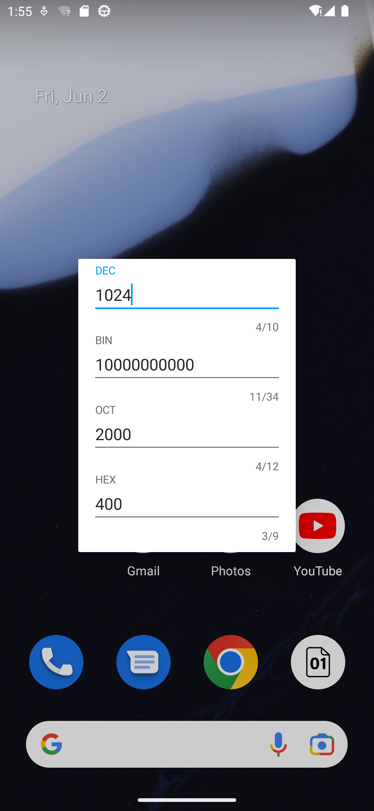

# Radix
十进制，二进制，八进制，十六进制数相互转换的计算器，采用 Rxbinding实现

# 用到的开源库
[RxJava 2.x](https://github.com/ReactiveX/RxJava)

[RxAndroid](https://github.com/ReactiveX/RxAndroid)

[butterknife](https://github.com/JakeWharton/butterknife)

[RxBinding](https://github.com/JakeWharton/RxBinding)

# 界面预览

# APK下载
[GooglePlay](https://play.google.com/store/apps/details?id=com.github.xiaofei_dev.radix)

[CoolApk](https://www.coolapk.com/apk/137663)

