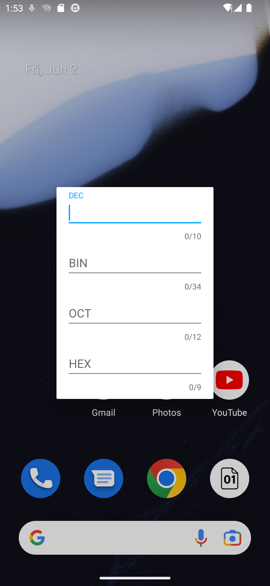

# Radix
A calculator for converting decimal, binary, octal, and hexadecimal numbers, implemented using Rxbinding.

# Download APK
[GooglePlay](https://play.google.com/store/apps/details?id=com.github.xiaofei_dev.radix)

# UI Preview
   

# Open Source Libraries Used
[RxJava 2.x](https://github.com/ReactiveX/RxJava)

[RxAndroid](https://github.com/ReactiveX/RxAndroid)

[butterknife](https://github.com/JakeWharton/butterknife)

[RxBinding](https://github.com/JakeWharton/RxBinding)
